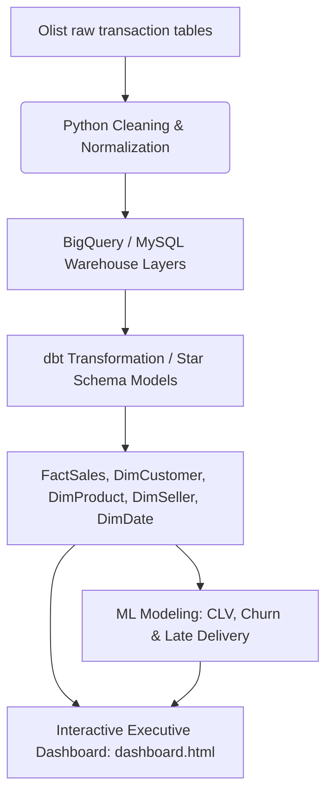

# Olist Customer Lifecycle Analytics Platform

An end-to-end e-commerce customer lifecycle and data warehousing platform analyzing customer retention, logistics performance, seller metrics, and lifetime value tiers for the Brazilian marketplace Olist.

This project transitions standard transactional e-commerce data into a production-ready analytical platform featuring an automated ETL architecture, a dimensional data warehouse (Star Schema), predictive customer modeling (CLV & Churn), and an interactive executive dashboard.

---

## Project Scale & Architecture



1. **Extraction & Warehousing**: Normalizes raw relational feeds into a clean staging schema.
2. **dbt Transformation (Star Schema)**: Implements modular SQL scripts (under `sql/`) to compile dimensional models ([DimCustomer](sql/05_star_schema_definition.sql#L12), [DimProduct](sql/05_star_schema_definition.sql#L21), [DimSeller](sql/05_star_schema_definition.sql#L31), [DimDate](sql/05_star_schema_definition.sql#L40)) and transaction facts ([FactSales](sql/05_star_schema_definition.sql#L51)).
3. **Advanced Analytics (Python & ML)**: Builds predictive models for repeat-purchase propensity (churn risk), delivery delay, and customer lifetime value (CLV) regression.
4. **Campaign Simulation**: Simulates the ROI of a targeted retention marketing campaign based on predicted customer churn risk.
5. **Interactive Dashboard**: Creates a premium, responsive executive dashboard ([dashboard.html](dashboard.html)) mirroring the layout and visual insights of the Power BI reporting layer.

---

## Repository Structure

```
├── sql/
│   ├── 01_schema_and_cleaning.sql      # Schema definitions and database initialization
│   ├── 02_feature_engineering.sql       # SQL queries for LTV and RFM metric generation
│   ├── 03_business_questions.sql       # Baseline customer lifecycle and analytical queries
│   ├── 04_views_and_optimization.sql   # Query performance optimization and views
│   └── 05_star_schema_definition.sql   # Data Warehouse Star Schema Fact and Dimension models
├── python/
│   ├── clean_data.py                   # Data ingestion and normalization
│   ├── eda_analysis.py                 # Initial data audit and profiling script
│   ├── phase5_advanced_analytics.py    # Churn, CLV, and Delivery ML model training
│   └── retention_simulation.py         # Retention campaign A/B test simulation and ROI calculator
├── notebooks/                          # Development explorations and scratch sheets
├── models/                             # Output model metrics and feature importance logs
├── docs/                               # Documentation, architecture specs, and reports
├── dashboard.html                      # Interactive 5-page Executive & ML Dashboard
└── README.md                           # Project platform documentation
```

---

## Core Analytics Modules & Insights

### 1. Retention & Cohort Performance
* **The Finding**: Only 3.0% of Olist's 93,358 unique customers placed a repeat purchase (2,793 repeat buyers). 
* **The Evidence**: Cohort retention analysis shows Month 1 retention averages 4.74%, dropping to 0.18% by Month 3.
* **The Action**: Shift from generalized customer acquisition campaigns to automated loyalty workflows.

### 2. Logistics & Delivery Performance
* **The Finding**: Late deliveries act as a primary driver of customer churn. 
* **The Evidence**: Olist’s baseline late delivery rate is 8.11%. Machine learning feature importance audits confirm that shipping delay (`first_delivery_days`) and freight cost (`first_avg_freight`) represent a combined 25.5% of churn predictability.
* **The Action**: Optimize seller dispatch SLAs and establish regional hubs in high-friction states to reduce transit days.

### 3. Geographical Value Distribution
* **The Finding**: Purchase volume and revenues are highly concentrated.
* **The Evidence**: The state of São Paulo (SP) alone drives 38.3% of total revenue. The top 5 states account for 73.2% of overall GMV.
* **The Action**: Allocate marketing acquisition spends primarily to high-volume states to maximize CAC efficiency.

### 4. Predictive Customer Lifetime Value (CLV)
* **The Finding**: First-order ticket size determines customer lifetime value.
* **The Evidence**: The RandomForestRegressor CLV model (R² = 0.92, MAE = R$ 9.70) reveals that `first_order_value` holds a 98.18% importance weight in predicting long-term spend.
* **The Action**: Prioritize marketing budgets toward acquiring customers on high-value categories (e.g., electronics, furniture) rather than low-value accessories.

---

## How to View & Run the Project

### 1. The Interactive Dashboard
* **How to run**: Simply double-click [dashboard.html](dashboard.html) to open in any web browser. 
* *Note: The Power BI `.pbix` file is being updated with the new star schema tables and will be added to the repo. In the meantime, the HTML dashboard replicates the exact layouts, metrics, and ML findings.*
* **Interactions**: Click through tabs to explore the **Executive Overview**, **RFM Segmentation**, **Cohort Retention Grid**, **Predictive ML Models**, and the **Data Pipeline Architecture**.

### 2. Running ML Models and Campaign Simulation
Install python dependencies:
```bash
pip install pandas numpy scikit-learn
```
Train the predictive models:
```bash
python python/phase5_advanced_analytics.py
```
Execute the retention campaign A/B simulation:
```bash
python python/retention_simulation.py
```

### 3. Warehouse Schema Generation
The SQL scripts in the `sql/` directory can be executed in sequence to set up the data warehouse. To create the dimensional model:
* Run the SQL statements in [05_star_schema_definition.sql](sql/05_star_schema_definition.sql) to build the Fact and Dimension tables in your warehouse.
