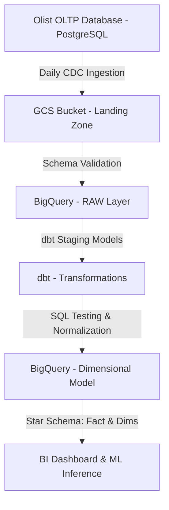

# Data Pipeline and Warehouse Architecture

This document describes the automated ETL (Extract, Transform, Load) pipeline architecture designed to scale this analysis into an end-to-end data platform.

---

## 1. Pipeline Architecture Diagram

---

## 2. Ingestion & Extraction (Apache Airflow)

We use **Apache Airflow** as the orchestration engine to manage the daily ingestion tasks. The extraction DAG (Directed Acyclic Graph) scheduled to run at `02:00 UTC` performs the following steps:

1. **Incremental Extraction**: Query the transactional PostgreSQL database for any new records created or modified in the last 24 hours (using Change Data Capture / Timestamp tracking).
2. **Cloud Landing**: Export the extracted records as compressed Parquet files to a Google Cloud Storage (GCS) landing bucket partitioned by date (`gcs://olist-landing/raw/year=YYYY/month=MM/day=DD/`).
3. **Table Partitioning**: Load the landing files into BigQuery RAW tables, appending new data to corresponding daily partitions.

---

## 3. Transformation Layer (dbt - Data Build Tool)

Transformations are managed inside **dbt** to ensure modular, version-controlled, and tested SQL logic. The dbt DAG executes three main stages:

### A. Staging Layer (`models/staging/`)
* **Deduplication**: Resolves duplicate records from raw transaction feeds using `row_number() over (partition by id order by updated_at desc)`.
* **Standardization**: Casts string timestamps to UTC datetimes, normalizes status columns, and scales numeric columns.
* **Schema Enforcement**: Basic nullness and uniqueness checks.

### B. Core Dimensional Layer (`models/core/`)
* Normalizes data into dimensions and facts mapping our Star Schema.
* Builds the surrogate keys using hashes (e.g. `FARM_FINGERPRINT` in BigQuery) to optimize joins.
* **dbt Schema Tests**:
  * Uniqueness and non-null tests on keys (`customer_key`, `product_key`, `seller_key`, `date_key`, `order_id`).
  * Referential integrity tests (ensuring foreign keys in `FactSales` resolve to their respective dimensions).

### C. Analytics Layer (`models/marts/`)
* Compiles pre-aggregated tables to feed the BI reporting views (e.g. `mart_customer_segmentation`, `mart_monthly_revenue`). This separates analytical query loads from raw warehouse joins, reducing costs and latency.

---

## 4. Pipeline Monitoring and Data Quality

* **DAG Retries**: Airflow tasks are configured with a 3-retry policy and Slack alert integrations for task failures.
* **dbt source freshness**: Freshness alerts are monitored to ensure data latency does not exceed 24 hours.
* **Model Lineage**: Lineage graphs automatically document dependencies from source tables down to final machine learning input tables.
